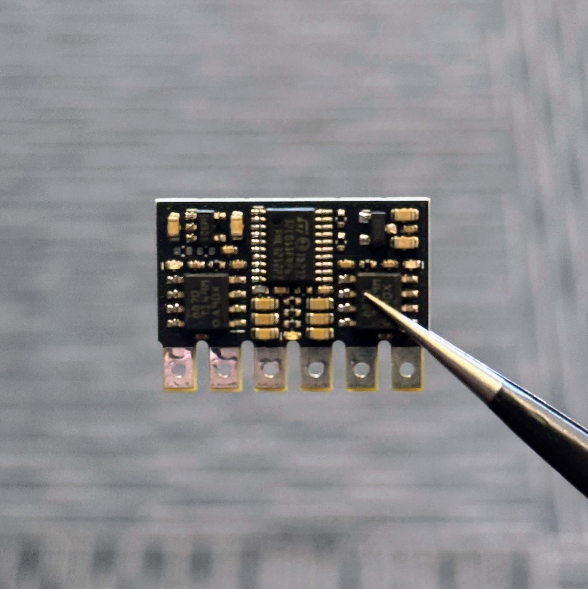
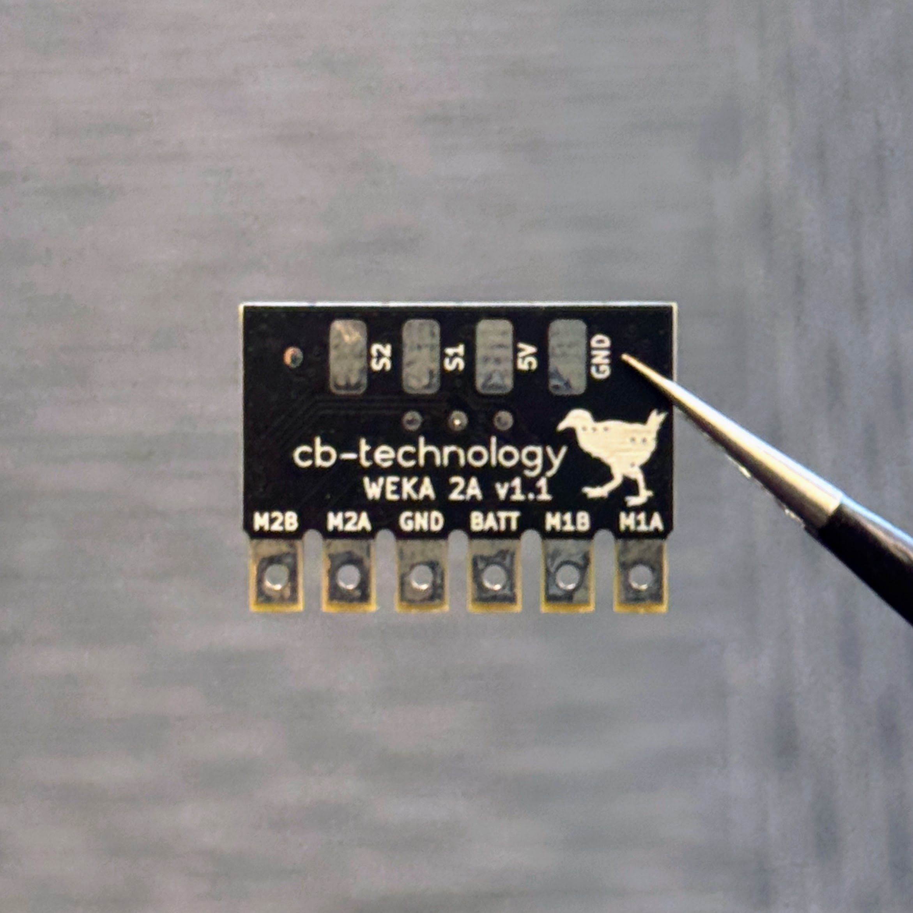

# WEKA - 2A v1.1

 

WEKA is a compact dual DC-motor ESC: originally designed for combat robots, but is suitable for any application requiring a lightweight durable motor driver.

Developed and tested in [Christchurch, New Zealand ](https://www.google.co.nz/maps/place/Christchurch+New+Zealand) by Connor Benton.

## FEATURES

- 2x Bi-Directional DC-motor outputs.
- Status LED's to indicate run mode, fault and calibration.
- Under-voltage, over-current, and over-temperature protections.
- Internal BEC to provide power to the radio reciever.
- Failsafe checks for loss of connection with radio.
- Calibrate function to customise drive mode, channel mapping, and channel inversion.
- Includes a 100nF capacitor across each motor to filter noise and voltage spikes.

## SPECIFICATIONS

- **Dimensions:** 24x17x4 mm
- **Weight:** 3g *excluding wires*
- **Input Voltage - Rated:** 2-4S LiPo (6.0-16.8V)
- **Input Voltage - Absolute Max:** 28V
- **Motor Output - Continuious:** 2A per channel 
- **Motor Output - Peak:** 3.6A per channel 
- **BEC:** 5V, 250mA. Designed to power the radio reciever but no servos
- **Signal Input:** Servo PWM

## USAGE
### Status LEDs

There are 3 LEDs on the WEKA (1x red, 2x blue). The red LED is in the center and a blue LED on edge beside each output.
 - **Normal Operation**
    - **No Power** Red: OFF, 2x Blue: OFF
    - **Standby** Red: ON, 2x Blue: OFF
    - **Driving** Red: ON, 2x Blue: ON. Each blue LED will illuminate when their corresponsing motor output is being driven.
 - **Fault Conditions**
    - **Signal-Input** RED: ON, 2x Blue: ALTERNATING FLASH
    - **Under-Voltage** RED: ON, 2x Blue: FLASH (1Hz)
    - **Over-Temperature** RED: ON, 2x Blue: FAST FLASH (5Hz)
 - **Calibration** RED: ON, 2x Blue: PATTERN. (See Calibration section for specific LED patterns) 

### Fault Conditions

In all fault conditions the input signals are ignored and both drive outputs are stopped. 
Once the fault condition is resolved, functionality will resume immediately. 
 - **Under-Voltage:** An under-voltage event occurs if the battery voltage falls below 3.1V (per cell). 
 - **Over-Temperature:** An over-temperature event occurs when the temperature sense circuit reaches 100°C.
 - **Signal-Input:** A signal-input fault occurs if either S1 or S2 inputs from the radio is lost. *Note: You still need to set the failsafe on the radio reciever to handle a loss of connection between the reciever and transmitter*.

### Calibration
###### Calibration Parameters

The WEKA has a number of parameters that are auto-detected during the calibration process. These are:

- **Driving Mode:**
    - Tank (Each input controls a different motor)
    - Arcade (One input controls both motor speeds and the second controls steering) 
- **Input Mapping:**
    - Any input channel can control any output.
    - eg: Using Arcade mode, the throttle channel from the radio can be soldered to either S1 or S2 on the WEKA, and vice-versa for the steering.  
- **Input Inversion:**
    - Any input channel can be reversed.
    - eg: No resoldering the motor wires or reversing the signal in radio.

The default calibration parameters from factory are:
- **Driving Mode:** ARCADE
- **Signal Mapping:** 
    - Signal 1 = Throttle 
    - Signal 2 = Steering
- **Input Inversion:**
    - Signal 1 = OFF
    - Signal 2 = OFF

###### Calibration Procedure

 1. Install the motors in the robot, in the orientation you want to use them. *This will allow auto-detection of the input mapping and inversion during the following Simon-says process.*

 2. Connect the radio reciever and motors to the WEKA. *Ensure the transmitter has been bound to the radio reciever prior to continuing calibration*.

 3. The following Simon-says calibration requires the motors rotate... if the wheels are touching the ground it will drive. So prepare your robot/setup to allow this.

 4. Turn WEKA ON and, within 10 seconds, trigger the calibration procedure by:
    - Wiggle any stick on the remote (that's connected to the WEKA) back and forward 20 times. 
    Make sure to push the stick from CENTER all the way to MAX/MIN when wiggling. 

 5. Both blue LEDs will pulse 10 times and then stay fully illumintaed to indicated the WEKA has entered CALIBRATION mode and is ready to begin. *The rest of the calibration happens pretty quickly so please read step 6 before proceeding*.

 6. To start, push any stick on the transmitter to MAX and back to CENTER. Both blue LED's will subsequently turn OFF.
    - Two tests are run back-to-back. Each test will twitch both motors and cause the robot to move forward, reverse, left, or right. 
    The user must then input that motion back into the remote. eg:
        - Robot twitches forward: Tank drive, simualtaneously push both sticks forward. Arcarde drive, push one stick forward.
        - Robot twitches left: Tank drive, simualtaneously push left stick back and right forward. Arade drive, push one stick left
    - The process for each test is:
        1. Both blue LED's turn OFF
        2. The motors twitch
        3. One blue LED turns ON
        4. User presses input(s) to MAX/MIN
        5. Second blue LED turns ON 
        6. User returns input(s) back to CENTER
        7. Both LED's pulse 3 times to indicate success
        8. Repeat for second test

 9. Calibration Complete
     - Both blue LEDs will pulse 10 times to indicate a successfull calibration.
     - Once the LED pulses are complete, the WEKA immediately enters Run mode with the new calibration.
     - If the WEKA is turned OFF before completing the calibration process, NONE of the new parameters are stored and it will revert to the previous configuraion. 

## DISCLIAMER

This product, and all other cb-technology products, are intended for use in hobby projects, and for educational and experimental uses. These devices are not suitable for any application where human life or health or significant property value depend on their proper operation. cb-technology ltd are not responsible for any loss or damage incurred by the operation or failure of this product or any others. The specifications listed are accurate to the best of our knowledge but are not guaranteed in any way. The buyer assumes all responsibility for proper use, testing, and verification of this unit in any application. cb-technology ltd liability is limited to replacement of defective DOA units. By installing and using this unit you are agreeing to these terms. If you do not agree you may return any unused units for a refund.
