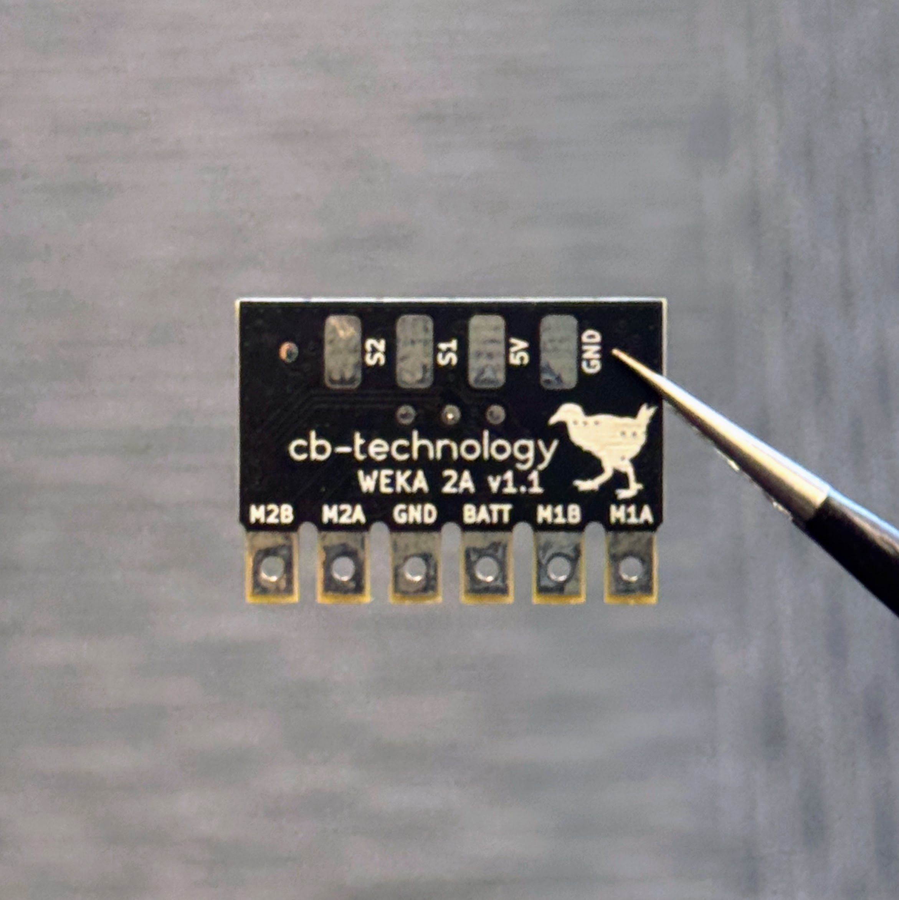

# WEKA SRL - 2A v1.2

 

The WEKA is a compact dual DC-motor speed controller, designed to be a robust lightweight control platform for combat robots and other high-performance robotic systems. It features flexible mixing options, braking control, and direct radio input compatibility, offering smooth integration without bulky wiring or external logic. 

The product is named after the [Weka](https://en.wikipedia.org/wiki/Weka), a curious and tenacious flightless bird endemic to New Zealand. 

Developed, assembled, and tested in [Christchurch, New Zealand ](https://www.google.co.nz/maps/place/Christchurch+New+Zealand) by Connor Benton. 

## FEATURES

- 2x Bi-Directional DC-motor outputs.
- Status LED's to indicate run mode, fault and calibration.
- Under-voltage, over-current, and over-temperature protections.
- Internal BEC to provide power to the radio reciever.
- Failsafe checks for loss of connection with radio.
- Calibrate function to customise drive mode, channel mapping, and channel inversion.
- Includes a 100nF capacitor across each motor to filter noise and voltage spikes.

## SPECIFICATIONS

- **Dimensions:** 24x17x4 mm 
- **Weight:** 3g *excluding wires*
- **Input Voltage:** 2-4S LiPo (6.0-16.8V)
- **Motor Output - Continuious:** 2A per channel 
- **Motor Output - Peak:** 3.6A per channel 
- **BEC:** 5V, 100mA. Designed to power the radio reciever but no servos
- **Signal Input:** Servo PWM

## USAGE
### Status LEDs

 There are 3 LEDs on the WEKA (1x red, 2x blue). The red LED is in the center and a blue LEDs are on each edge beside the motor outputs. See table below to detail LED behaviour:

| State                     | Red LED   | Blue LEDs | | 
| :---:                     | :---:     | :---:     | :---  
| No Power                  | OFF       | OFF       |  
| Standby                   | ON        | OFF       |         
| Driving                   | ON        | ON        | Each blue LED will immunimate when their corresponding input is being driven. 
| Fault Signal-Input        | ON        | ALTERNATING FLASH       | 1Hz  
| Fault Under-Voltage       | ON        | FLASH         | 1Hz
| Fault Over-Temperature    | ON        | FAST FLASH    | 5Hz 
| Calibration               | ON        | PATTERN       | See Calibration section for specific LED patterns

### Fault Conditions
WEKA continuously monitors for several fault conditions during operation. The monitored faults, listed from highest to lowest priority, are:

1. **Over-Temperature:** An over-temperature fault occurs when the primary sense circuit reaches 100°C. There is also a backup sensor for each motor output that trips at 150°C.

2. **Under-Voltage:** An under-voltage fault occurs if the battery voltage falls below 3.0V (per cell).

    Important note: When WEKA powers on, it automatically detects how many cells your battery has to set the appropriate low voltage level. Some battery cell counts have a voltage overlap with adjacent counts, see table below. So, the WEKA then assumes the battery is more charged when powering on to solve the overlap. If you start up with a low battery, it might detect and set the undervoltage threshold too low. To avoid issues, we recommend powering on with a fully-charged battery. 

    | Battery Cells | Low Voltage   | High Voltage  | At Risk   | Percentage Overlap |
    | :---:         | :---:         | :---:         | :---:     | :---: |
    | 2s            | 6.0V          | 8.70V         | No        | n/a |
    | 3s            | 9.0V          | 13.05V        | No        | n/a |
    | 4s            | 12.0V         | 17.40V        | Yes       | 19.4% |

3. **Signal-Input:** WEKA uses an intelligent failsafe system that monitors each input channel individually and only disables the output corresponding to the lost input.
    - Example: In arcade drive mode, if the throttle channel is lost, the motors stop driving forward/backward, but turning still works.

    The LED will show a signal-input fault whenever one or more input channels are lost.

    *Note: You should still set the failsafe on the radio reciever to handle a loss of connection between the reciever and transmitter.*

### Calibration
###### Calibration Parameters

The WEKA has a number of parameters that are auto-detected during the calibration process. These are:

- **Driving Mode:**
    - Tank (Each input controls a different motor)
    - Arcade (One input controls both motor speeds and the second controls steering) 
- **Motor Braking:**
    - When drive inputs are zero, you can choose if you want the wheels to coast or brake.
- **Input Mapping:**
    - Any input channel can control any output.
    - eg: Using Arcade mode, the throttle channel from the radio can be soldered to either S1 or S2 on the WEKA, and vice-versa for the steering.  
- **Input Inversion:**
    - Any input channel can be reversed.
    - eg: No resoldering the motor wires or reversing the signal in radio.

If at any point the calibration is corrupted, the WEKA will roll back to the factory settings:
- **Driving Mode:** Arcade
- **Motor Braking:** Enable
- **Motor A:**
    - Channel: 1
    - Reverse: False
- **Motor B:**
    - Channel: 2
    - Reverse: False

### Calibration Procedure

Please read this section in full before initiating calibration for the first time. The process moves quickly once started, but becomes intuitive after your first go around.

Calibration settings are only saved once the entire procedure is completed. If you make a mistake, just power cycle the device and start again, nothing is saved until the end. 

1. Preparation
    - Install the motors in the orientation you want in the robot. This allows the system to correctly detect mapping and direction during calibration.
    - Connect the motors and radio receiver to the WEKA. 
    - Ensure the receiver is bound to your transmitter.
    - Make sure the robot is elevated or safe to move within a test-box. The robot will twitch the during calibration.

2. Entering Calibraiton Mode
    - Power on the WEKA.
    - Within 10 seconds, wiggle any connected input stick 20 times (must be wiggled full forward and full reverse).
    - Calibration will only begin if both input channels are detected and the WEKA is not in a fault condition.
    - Both blue LEDs will pulse 10× to confirm entering calibration mode.
    - While the LEDs are pulsing, the user must stop wiggling the stick and return all inputs to their neutral positions.
    - Once the LEDs have finished pulsing, they will remain solid and wait for the user to start the calibratrion.

3. Drive Mode Detection.
    
    This stage uses a "Simon-says" process that twitches the motors (moves the robot in a direction) and getting the user to input that motion back on the remote. For example:
    - Robot twitches forward: Simualtaneously push both sticks forward for tank drive, or push one stick forward for arcade.
    - Robot twitches left: Simualtaneously push left stick back and right forward for tank, or push one stick left for arcade.

    The steps for this stage are:
    - Both LEDs are ON from step 2.
    - Move any stick to MAX and back to CENTER to start.
    - The Simon-says process is: 
        1. Both LEDs turn OFF.
        2. Robot twitch in a direction.
        3. One LED turns ON.
        4. Match that robot motion on your radio using the desired driving style.
        5. Second LED turns ON.
        6. Return stick(s) to CENTER.
        7. Both LEDs turn OFF.
        8. Both LEDs pulse 3× to confirm completion of current step.
    - The Simon-says process repeats for a second direction.

4. Motor Braking Detection

    After drive mode is confirmed, the WEKA immediatley enters the motor braking detection stage:

    - Both LEDs turn OFF.
    - Motors very quicly twitch.
    - One LED turns ON.
    - To enable braking:
        - Within 5 seconds, move any stick to MAX.
        - Second LED turns ON.
        - Return stick to CENTER.
        - Both LEDs turn OFF.
        - Motors will quickly twitch again to confirm detection.
    - To disable braking:
        - Do nothing.
        - After a timeout of 5 seconds it will automatically proceeed.
        - Unlike braking enable, the motors will not twitch again.
    - Both LEDs pulse 3× to confirm completion of current step.

 6. Calibration Complete
     - Both blue LEDs pulse 10× to indicate completion of calibration and the parameters are saved.  
     - The WEKA immediately enters Normal Operation using the new calibration settings.
     

## DISCLIAMER

This product, and all other cb-technology products, are intended for use in hobby projects, and for educational and experimental uses. These devices are not suitable for any application where human life or health or significant property value depend on their proper operation. cb-technology ltd are not responsible for any loss or damage incurred by the operation or failure of this product or any others. The specifications listed are accurate to the best of our knowledge but are not guaranteed in any way. The buyer assumes all responsibility for proper use, testing, and verification of this unit in any application. cb-technology ltd liability is limited to replacement of defective DOA units. By installing and using this unit you are agreeing to these terms. If you do not agree you may return any unused units for a refund.
